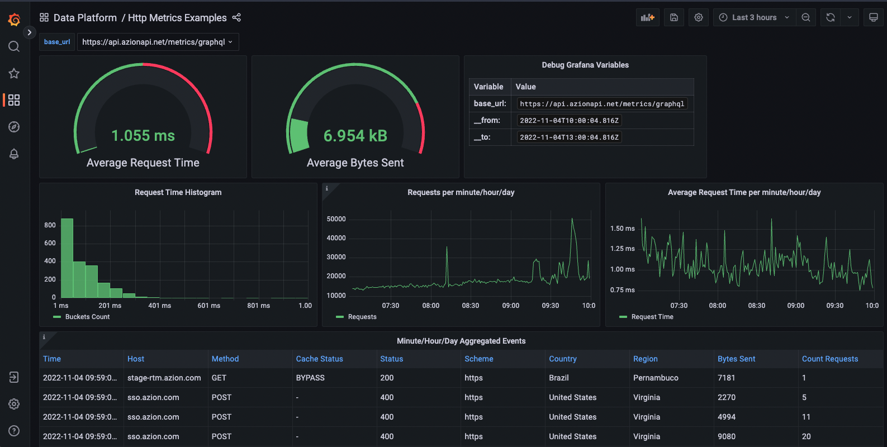

# Azion Metrics GraphQL Grafana
A set of analytics visualizations and metadata introspections based on our Metrics GraphQL API and Grafana.

## Get started
1. Make sure you have Docker and Docker Compose on your system.

2. Create a Personal Token on your Azion Real-Time Manager account menu.
See the documentation [here](https://www.azion.com/en/documentation/products/accounts/personal-tokens).

3. Set your new Personal Token for this project usage.
Create a new file called `.env` (with the point at the beginning) and set the `PERSONAL_TOKEN` on it.
After the change, the file should look something like this:
```
PERSONAL_TOKEN=aziondfc05bbb72ba5...
```

4. Start the container. Run:
```
$ docker-compose up -d
```

5. Go to http://localhost:3000

That's it, now enjoy the samples. Feel free to drop us an issue if your need help.

## Screenchots


## Additional material
- There is a [Insomnia](https://insomnia.rest/download) document within this project called `Insomnia.json`. 
If you prefer to learn APIs through a spec-first perspective this will help you.
	- Set your Azion Personal Token on the Insomnia Production environment.
	- Install the [insomnia-plugin-customtimestamp](https://github.com/Gabb1995/insomnia-plugin-customtimestamp) plugin.
- [Azion Documentation](https://www.azion.com/en/documentation)
- [Personal Token Documentation](https://www.azion.com/en/documentation/products/accounts/personal-tokens)
- [Metrics GraphQL API Documentation](https://www.azion.com/en/documentation/products/graphql-api)

